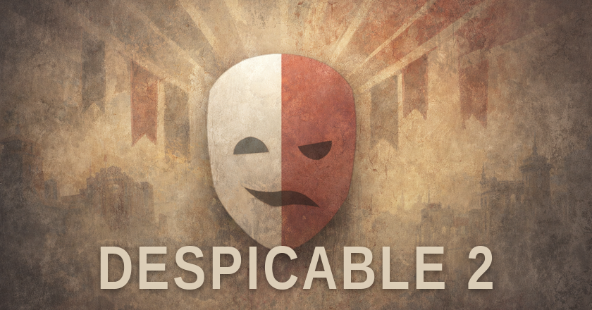

# Despicable 2



A modular RimWorld 1.6 mod suite with face parts, facial animation, Hero Karma, custom UI, and shared animation systems.

## Overview

**Despicable 2** is a modular RimWorld suite built around expressive pawn presentation, reusable systems, and a stronger interface layer.

The repository is centered on **Despicable 2 (Core)**, which works as a standalone mod and as the required foundation for optional add-ons. Core adds face parts, facial expressions, shared animation systems, Hero Karma, custom UI tools, and supporting infrastructure designed for compatibility and long-term maintainability.

An optional **Despicable 2 (NSFW)** add-on extends Core with adult-only intimacy content, extra animation hooks, additional rendering features, sound, and expression support. It is intentionally separated from Core by design.

## Modules

### Despicable 2 (Core)

The Core package is the backbone of the suite.

It includes:
- face parts and facial expression systems for more expressive pawns
- facial animation support with reusable animation definitions and render nodes
- Hero Karma systems with faction standing, reputation effects, perks, and dedicated UI
- a custom UI framework for windows, tabs, tables, rulers, forms, search, and debug-friendly layouts
- shared animation infrastructure for playback, offsets, visual events, and authoring workflows
- manual interaction menu systems for cleaner interaction-driven UX
- localization support with English source strings and translated language folders
- compatibility-first architecture with runtime guards, isolated integrations, and soft-fail behavior where possible

### Despicable 2 (NSFW)

The NSFW package is an optional adult-only add-on that depends on Core.

It includes:
- explicit intimacy content and related job logic
- additional animations, sounds, expressions, and render features
- compatibility bridges for supported adult-content integrations
- a separate dependency boundary so Core remains modular and clean

## Feature summary

### Core highlights
- **FacePartsModule** for face styles, customizers, expressions, and rendering
- **HeroKarmaModule** for karma events, faction standing, local reputation, perks, diagnostics, and UI
- **AnimModule** for shared animation logic, playback, render support, and tooling
- **UIFramework** for reusable layout helpers, widgets, shells, tables, search, and overlays
- **ManualInteraction** for structured manual interaction flows and request handling

### Design goals
- modular growth without turning the codebase into a knot
- reusable systems instead of one-off hacks
- compatibility-minded integrations
- cleaner custom UI and better presentation
- room for optional content without bloating Core

## Requirements

- **RimWorld 1.6**
- **Harmony**

## Installation

### Core only
1. Install **Harmony**.
2. Add **Despicable 2 (Core)** to your RimWorld 1.6 mods.
3. Enable it in your mod list.

### Core + optional NSFW
1. Install **Harmony**.
2. Enable **Despicable 2 (Core)**.
3. Enable **Despicable 2 (NSFW)** below Core.
4. Keep RimWorld's dependency and load-order warnings satisfied.

## Compatibility

This suite is built with a compatibility-first approach.

- **Core is standalone** and can be used by itself.
- **NSFW requires Core**.
- The mod metadata includes explicit `loadAfter` hints for **Harmony** and selected optional targets.
- Optional integrations are kept isolated where possible to reduce hard failures when other mods are absent.
- The codebase favors guarded integrations and stable seams over brittle hard assumptions.

## Languages

The repository currently includes language support for:
- English
- Chinese Simplified
- French
- German
- Russian
- Spanish

## Repository layout

```text
Despicable2-Core/
  1.6/
  About/
  Config/
  Defs/
  Docs/
  Languages/
  Patches/
  Source/
  Textures/
  Tools/

Despicable2-NSFW/
  1.6/
  About/
  Defs/
  Languages/
  Patches/
  Sounds/
  Source/
  Textures/
```

## Development notes

This repository is strongly oriented toward modular growth, additive changes, and documented guardrails.

Some of the included development docs in `Despicable2-Core/Docs/` cover:
- architecture and extension rules
- consistency and maintenance guardrails
- UI framework guidance and layout rules
- localization workflow and validation guardrails
- smoke test expectations

The project generally prefers:
- framework-driven UI layout instead of brittle hardcoded positioning
- isolated optional integrations
- localization as a first-class pipeline
- extending stable systems rather than rewriting broad surfaces at random

## Release channels

To keep releases simple, this project uses three release types:
- **alpha** for rough or experimental public testing
- **beta** for wider testing before normal release
- **stable** for standard public releases

Example tags:
- `v0.8.0-alpha.1`
- `v0.8.0-beta.1`
- `v0.8.0`

## GitHub About

**Description**

A modular RimWorld 1.6 mod suite with face parts, facial animation, Hero Karma, custom UI, and shared animation systems.

**Tagline**

Expressive pawns, modular systems, and a little frontier grandeur gone rotten.

**Suggested topics**

`rimworld` `rimworld-mod` `rimworld-1-6` `harmony` `csharp` `modding` `animation-system` `ui-framework` `localization` `character-customization`

## Licensing

This repository uses a split-license model.

- **Code, XML defs, patches, config, and documentation** are licensed under the **MIT License**. See [`LICENSE`](LICENSE).
- **Visual, audio, and branding assets** are licensed separately under **CC BY-NC-ND 4.0**. See [`LICENSE.assets`](LICENSE.assets).

If a file or directory is marked with a different license notice, that notice takes precedence for the covered content.

## Disclaimer

RimWorld is © Ludeon Studios. This project is an unofficial fan-made mod suite and is not affiliated with or endorsed by Ludeon Studios.
